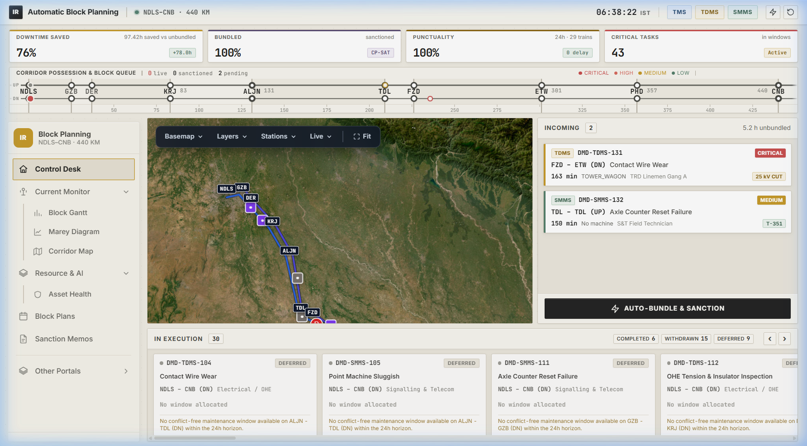
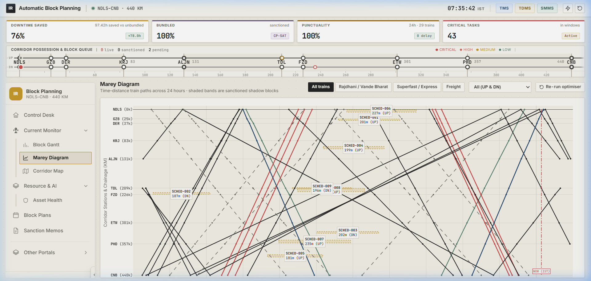
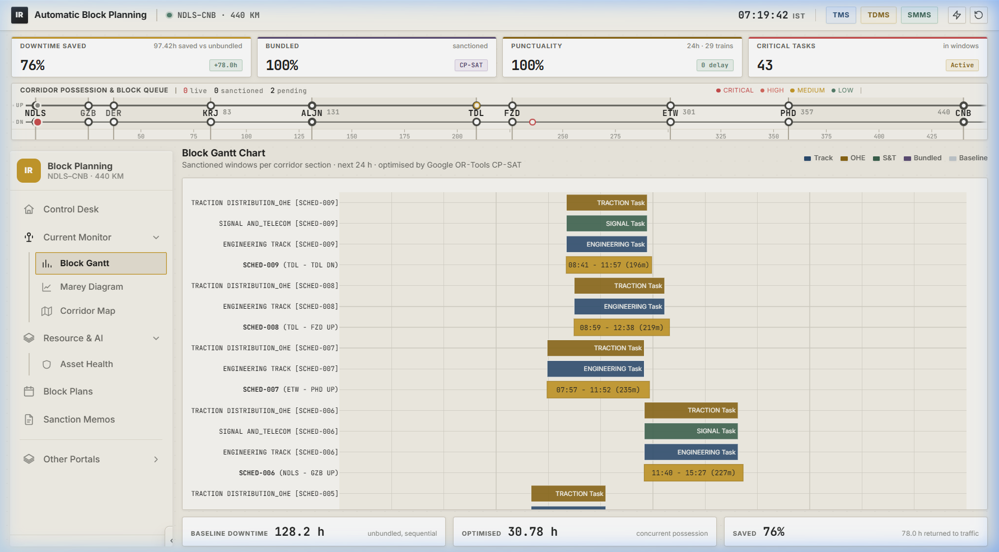
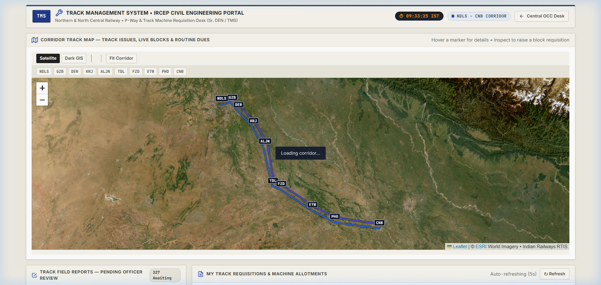
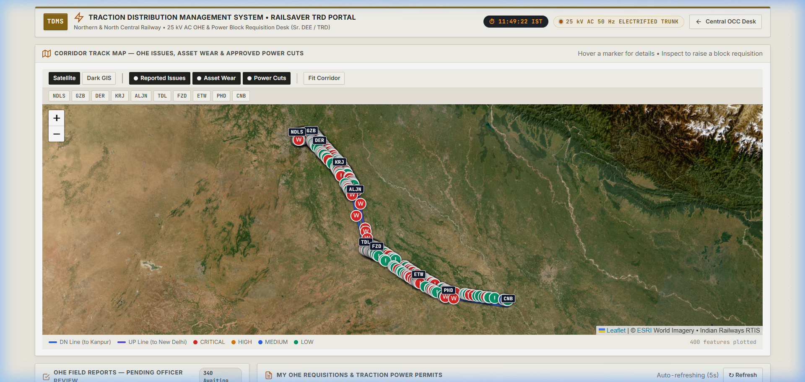
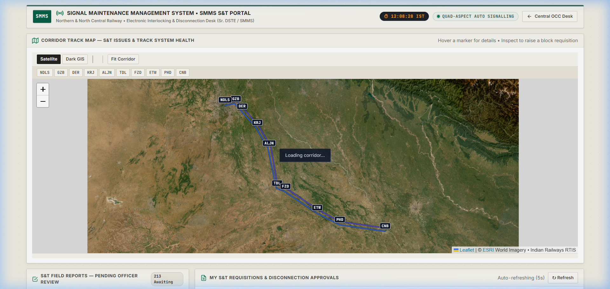
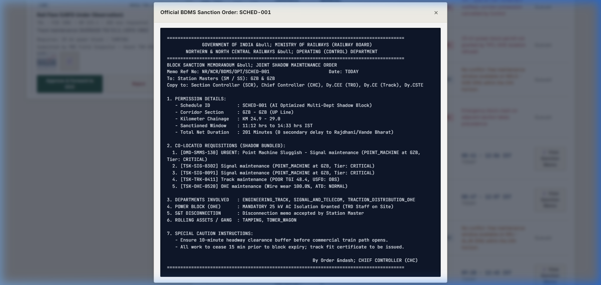
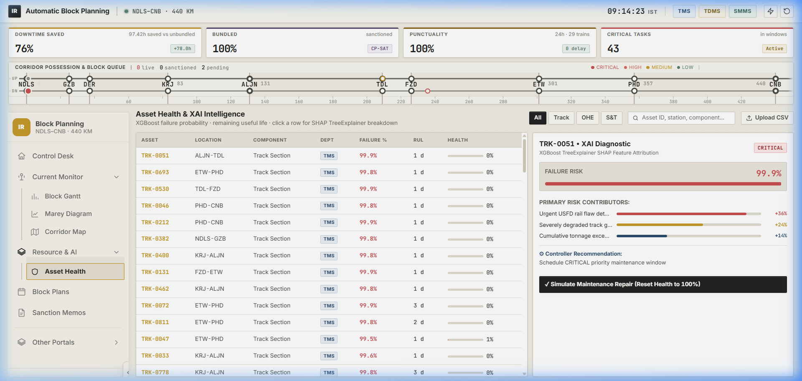
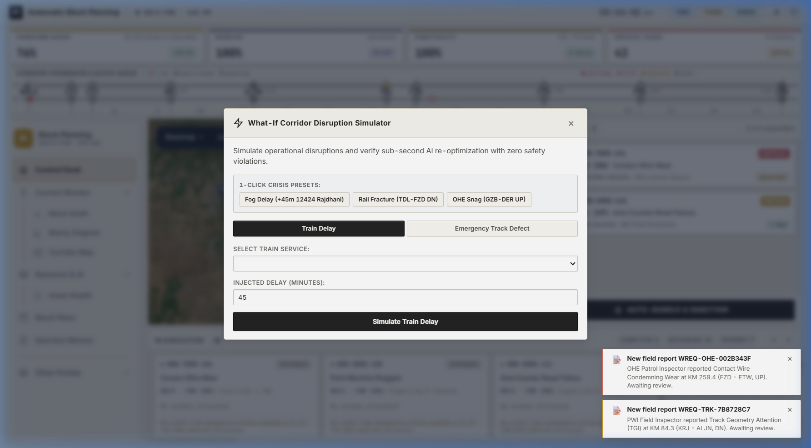

<div align="center">

# Indian Railways AI Automatic Block Planning System

### High-Density Corridor Multi-Department Shadow Maintenance & Operational Optimization Platform

[](https://www.python.org/)
[](https://fastapi.tiangolo.com/)
[](https://developers.google.com/optimization)
[](https://xgboost.ai/)
[](https://leafletjs.com/)
[](https://plotly.com/javascript/)
[](LICENSE)
[]()

<br>

An enterprise-grade mathematical optimization and predictive intelligence platform designed to eliminate corridor capacity loss across Indian Railways high-density trunk lines. It unifies Civil (TMS), Electrical (TDMS) and S&T (SMMS) maintenance backlogs into coordinated "shadow block" possessions using Google OR-Tools CP-SAT constraint programming and XGBoost failure prediction — then runs the whole thing live, with an accelerated corridor clock, a field-report simulator, a dual-track geospatial map, and a four-screen operations network that carries a defect from the trackside all the way to an executed block.

<br>

[Overview](#overview) &bull;
[System Architecture](#system-architecture) &bull;
[Two-Tier Hybrid Engine](#two-tier-hybrid-decision-engine) &bull;
[Multi-Department Portals](#multi-department-field-portals) &bull;
[The Live Corridor](#the-live-corridor-simulator) &bull;
[Corridor Map](#the-corridor-map-service) &bull;
[Visual Walkthrough](#how-it-works-visual-walkthrough) &bull;
[Processing Pipeline](#processing-pipeline--lifecycle) &bull;
[Mathematical Formulations](#engineering-standards--mathematical-formulations) &bull;
[Results](#measured-results) &bull;
[Multi-Laptop Operations](#multi-laptop-offline-operations-field-demo-guide) &bull;
[Developer Guide](DOCUMENTATION.md) &bull;
[Getting Started](#getting-started--operations)

</div>

---

## Overview

### The Operational Challenge
On high-density trunk routes across Indian Railways — such as the 440 KM New Delhi – Kanpur Central corridor — maintenance is historically executed in departmental silos:

- **Civil Engineering (Track / TMS):** rail grinding, mechanised tamping, and ultrasonic rail flaw detection (USFD).
- **Electrical Traction (TRD / TDMS):** 25 kV AC contact wire renewal, overhead equipment (OHE) stagger correction, and isolator servicing.
- **Signalling & Telecommunication (S&T / SMMS):** point machine overhauls, track circuit testing, and axle counter maintenance.

When these departments apply independently through manual Block Demand Management System (BDMS) requests, the corridor suffers fragmented traffic blocks, severe line capacity degradation, and compounding train delays.

```
FRAGMENTED INDEPENDENT POSSESSIONS (BASELINE)
Track Dept : [---- 3.5 Hrs ----]
OHE Dept   :                     [---- 3.0 Hrs ----]
S&T Dept   :                                         [---- 2.5 Hrs ----]
Corridor Impact: 9.0 Hours Total Closure • Multiple Headway Interruptions

AI MULTI-DEPARTMENT SHADOW POSSESSION (THIS SYSTEM)
Unified Block : [======== 3.5 Hrs Combined Possession ========]
Corridor Impact: 3.5 Hours Total Closure • 5.5 Hours Saved • Zero Train Delay
```

### Key Architectural Capabilities

- **Google OR-Tools CP-SAT mathematical optimizer.** Evaluates 87 timetable headway gaps against multi-department task combinations simultaneously to construct provably optimal, conflict-free possession windows — in a fraction of a second.
- **Predictive asset intelligence (XGBoost + SHAP).** Predicts asset failure probability at **0.9751 ROC-AUC**, remaining useful life, and required possession duration, with plain-English feature attribution cards written the way an inspector would write them.
- **A live corridor, not a static plan.** An accelerated 80× clock, a daemon that manufactures field reports grounded in real backlog rows, and a lifecycle engine that walks each sanctioned block through execution to completion — or occasional withdrawal by control, with a stated reason.
- **Authentic four-screen operations network.** Three department portals (IRCEP TMS, RailSaver TDMS, SMMS IR) where officers triage photographic and PDF field evidence, feeding a Central Operations Control Center with human-in-the-loop sanctioning.
- **Reusable dual-track geospatial map.** One Leaflet module, mounted identically on all four screens, rendering UP and DN as two genuinely separate rails with seven live feature layers and 29 moving trains.
- **Sub-second dynamic disruption rescheduler.** Absorbs a +45 min passenger delay or an emergency rail fracture and re-solves the corridor in well under a second.
- **Automated BDMS sanction generation.** Drafts standardised Block Sanction Memoranda ready for dispatch to Section Controllers and Station Masters.
- **Runs entirely on free, open-source software.** No paid solver, no API keys, no cloud dependency. Every heavy dependency degrades gracefully if absent.

---

## System Architecture

The platform operates across four connected screens and seven modular processing layers.

```
┌──────────────────────────────────────────────────────────────────────────────────────────────────┐
│                                   AUTHENTIC 4-PORTAL ARCHITECTURE                                │
│                                                                                                  │
│  [ /tms ] Track Desk            [ /tdms ] OHE Desk             [ /smms ] S&T Desk                │
│  - IRCEP Civil Portal           - RailSaver TRD Portal         - SMMS Signalling Portal          │
│  - Rail flaw & tamping reports  - 25 kV AC isolation demands   - Point & track circuit notices   │
│  - P-Way gang field evidence    - Tower wagon requisitions     - S&T/T-351 disconnection slips   │
│  - Layers: issues/blocks/       - Layers: issues/assets/       - Layers: issues/health           │
│            routines                       powercuts                                              │
│            │                              │                              │                       │
│            └──────────────────────────────┼──────────────────────────────┘                       │
│                                           v                                                      │
│                        [ / ] CENTRAL OPERATIONS CONTROL CENTER (OCC)                             │
│                        - Chief Section Controller master workspace                               │
│                        - Fixed 50/50 INCOMING / IN EXECUTION control-room board                  │
│                        - 1-click "Auto-Bundle & Sanction Joint Shadow Block"                     │
│                        - Layers: demands / blocks + live trains                                  │
└───────────────────────────────────────────┬──────────────────────────────────────────────────────┘
                                            │
                                            v
+----------------------------------------------------------------------------------------------------+
|                                  PREDICTIVE MACHINE LEARNING ENGINE                                |
|  +--------------------------+  +---------------------------+  +----------------------------------+ |
|  | XGBoost Risk Classifier  |  | XGBoost RUL Regressor     |  | Random Forest Duration Model     | |
|  | Target: failure w/in 30d |  | Target: remaining days    |  | Target: possession duration      | |
|  | 0.9751 ROC-AUC / 91.1%   |  | 67.6 Days RMSE            |  | 12.25 Min RMSE                   | |
|  +-------------+------------+  +-------------+-------------+  +-----------------+----------------+ |
|                +-----------------------------+----------------------------------+                  |
|                                              v                                                     |
|                 +------------------------------------------------------------+                     |
|                 | SHAP TreeExplainer + rule-based controller cards (XAI)      |                    |
|                 +----------------------------+-------------------------------+                     |
+----------------------------------------------|-----------------------------------------------------+
                                               v
+----------------------------------------------------------------------------------------------------+
|                            DETERMINISTIC RDSO PRIORITY SCORING ENGINE                              |
|  | IRPWM Para 607 Track Geometry Index (TGI) • ACTM Para 20325 Contact Wire Wear Calculation        |
|  | IRSEM Para 700 Point Machine Throw Diagnostics • Rail Thermal Stress (Td Buckling Limit)        |
|  | Composite Criticality Formula: 35*P(fail) + 25*RUL + 20*RouteClass + 10*(Comp-1)*2 + 15*(TSR)   |
+----------------------------------------------+-----------------------------------------------------+
                                               v
+----------------------------------------------------------------------------------------------------+
|                                   MATHEMATICAL OPTIMIZATION ENGINE                                 |
|  | Slot Discovery: timetable scanner, usable gap >= 45m after a 10m clearance  ->  87 slots       | |
|                                              v                                                     |
|  | Spatial Clustering: partition by (section, line), 3 km radius, <=4 tasks  ->   494 bundles     | |
|                                              v                                                     |
|  | Google OR-Tools CP-SAT assignment model  (greedy first-fit fallback if OR-Tools absent)        | |
|  | Objective: criticality + multi-dept bonus + night bonus + raised-demand priority               | |
|  |            + upcoming-window preference - possession duration penalty                          | |
|  | Hard: one bundle per slot, one slot per bundle, section/line/duration fit, machine fleet limits | |
+----------------------------------------------|-----------------------------------------------------+
                                               v
+----------------------------------------------------------------------------------------------------+
|                                     LIVE CORRIDOR SIMULATOR                                        |
|  | 80x accelerated clock  |  field-report daemon  |  block lifecycle  |  sequenced event log      | |
|  | 24h in ~18 real min    |  grounded in real rows|  APPROVED->DONE   |  drives every toast       | |
+----------------------------------------------|-----------------------------------------------------+
                                               v
+----------------------------------------------------------------------------------------------------+
|                            OCC & FIELD DESKS (WARM INDUSTRIAL DESIGN SYSTEM)                       |
|  +------------------------+ +-------------------------+ +---------------------+ +----------------+ |
|  | Marey String Diagram   | | Multi-Dept Gantt View   | | Dual-Track Corridor | | Yard Interlock | |
|  | (Plotly.js Time-Dist)  | | (Shadow Bundling Recov) | | Map (Leaflet/ESRI)  | | (Option C SVG) | |
|  +------------------------+ +-------------------------+ +---------------------+ +----------------+ |
|  +----------------------------------------------------+ +----------------------------------------+ |
|  | 4-Tier Surface Hierarchy (Level 0-3 Depth Physics) | | BDMS Digital Sanction Memo (Form 104)  | |
|  +----------------------------------------------------+ +----------------------------------------+ |
+----------------------------------------------------------------------------------------------------+
```

---

## Two-Tier Hybrid Decision Engine

A common dilemma in railway operations is whether to rely on **Statistical Machine Learning (XGBoost)** or **Deterministic Engineering Rules (RDSO Priority Engines)**:
- **Pure ML Models** can feel like "black boxes" to railway regulators (Commissioner of Railway Safety - CRS, Senior Section Engineers) who require strict, rule-based auditability.
- **Pure Rule Engines** evaluate parameters additively ($S = \sum w_i x_i$) and easily miss multi-variable, non-linear wear coupling (e.g. ambient rail temperature delta + heavy cumulative GMT + track twist accelerating contact wire fatigue), nor can they compute continuous Remaining Useful Life (RUL) days.

To solve this, our platform implements a **Two-Tier Hybrid Architecture**:

```
[ Field Sensor Telemetry & Backlog Ingestion ]
                    │
                    ▼
┌────────────────────────────────────────────────────────┐
│  TIER 1: EMPIRICAL CONDITION & RUL FORECASTING (ML)    │
│  • XGBoost Risk Classifier: P(failure within 30 days)  │
│  • XGBoost RUL Regressor: continuous days remaining    │
│  • Random Forest Regressor: possession duration (min)  │
│  • SHAP TreeExplainer: domain-specific inspector cards │
└──────────────────────────┬─────────────────────────────┘
                           │ Outputs: failure_prob, predicted_rul_days
                           ▼
┌────────────────────────────────────────────────────────┐
│  TIER 2: DETERMINISTIC RDSO PRIORITY ENGINE (FORMULAS) │
│  • IRPWM Para 607: Track Geometry Index (TGI) penalty  │
│  • ACTM Para 20325: Contact wire wear thickness limit  │
│  • IRSEM Para 700: Point machine throw/current limits  │
│  • Composite Criticality Formula (0–100 scale):        │
│    Score = 35·P(fail) + 25·Urgency(RUL) + 20·Route     │
│            + 10·(Compounding - 1)·2 + 15·(TSR Active)  │
└──────────────────────────┬─────────────────────────────┘
                           │ Strict 0–100 Priority Weight
                           ▼
┌────────────────────────────────────────────────────────┐
│  MATHEMATICAL OPTIMIZATION (GOOGLE OR-TOOLS CP-SAT)   │
│  • Enforces hard safety headways, isolation permits,   │
│    machinery rosters, and conflict-free slot windows.  │
└────────────────────────────────────────────────────────┘
```

1. **XGBoost as an Empirical Degradation Sensor:** Models non-linear asset wear from multi-source telemetry without hardcoding hundreds of fragile nested thresholds.
2. **RDSO Engineering Formulas as Safety Gates:** Translates raw probabilities into codal, regulatory priority scores citing official Indian Railways manuals ([rdso_formulas.py](src/generator/rdso_formulas.py)).
3. **Google OR-Tools CP-SAT as the Arbiter:** Proves mathematical optimality and guarantees that passenger headways and safety clearances are never compromised.

---

## Multi-Department Field Portals

Four dedicated web interfaces modelling real Indian Railways field applications:

| Portal | URL Route | Real-World System | Operational Role |
| :--- | :--- | :--- | :--- |
| **Track Management System (TMS)** | `/tms` | Indian Railways Civil Engineering Portal (IRCEP) | Rail flaw triage, tamping/BCM requisitions, P-Way gang allotment, routine inspection tracking |
| **Traction Distribution Management System (TDMS)** | `/tdms` | RailSaver TRD Portal | 25 kV OHE contact wire monitoring, tower wagon requests, mandatory power cut isolation permits, asset wear watch |
| **Signal Maintenance Management System (SMMS)** | `/smms` | SMMS IR Signalling Portal | Point machine throw diagnostics, track circuit voltage logs, mandatory S&T/T-351 disconnection notices, per-section system health |
| **Central Operations Control Center (OCC)** | `/` | Control Office Master Desk | Corridor aggregation, live demand bundling, CP-SAT solving, BDMS sanction dispatch, live execution board |

Each portal shows the officer exactly two things about every reported defect, from a single source of truth: a **review card** with the field evidence, and a **map marker** at the correct chainage. Approving from either produces an identical requisition.

### Auto-enforced safety rules
Safety precedence is enforced in the backend, in one place, never in the UI:

- Any **TRACTION_DISTRIBUTION_OHE** demand, or any demand requiring `BCM`, `CSM` or `TAMPING` machinery near live 25 kV OHE, forces `power_block_required = true`.
- Any **SIGNAL_AND_TELECOM** demand forces `disconnection_required = true` (Form S&T/T-351).

Both rules are covered by dedicated tests.

---

## The Live Corridor Simulator

The system does not present a static plan. It runs a corridor.

| Component | What it does |
| :--- | :--- |
| **Virtual clock** | 80× acceleration — 24 simulated hours pass in about 18 real minutes. Stateless: simulated now is a pure function of real elapsed time, so nothing can desynchronise. The epoch is pinned to 05:00 because every window long enough to host a real block starts between 06:00 and 12:00 on this timetable, so a demo always has the usable band ahead of it. |
| **Field-report generator** | A daemon manufacturing worker-submitted reports every 25–40 simulated minutes per department. Every report is built from a **real row** of the 1,850-asset backlog — tier, criticality, machinery and safety flags carried forward, not randomised — and restricted to locations the solver can actually schedule. Each carries 1–2 site photos and a one-page inspection PDF. |
| **Block lifecycle engine** | Walks sanctioned demands `APPROVED_SHADOW_BLOCK → IN_PROGRESS → COMPLETED` against the clock. Occasionally control withdraws an upcoming block with a realistic reason — a late-running superfast needing the path, an unavailable tower wagon, dense fog. Conservative by design: at most one withdrawal per 90 simulated minutes, never the last remaining block, never work already under way. |
| **Event log & notifications** | Eight event kinds, sequenced with a monotonic counter that every screen uses as a high-water mark, so each page only ever toasts what it has not already shown. |

The result is a demo that keeps producing genuine work for as long as the server is up, and an execution board that visibly moves.

---

## The Corridor Map Service

An independent, reusable geospatial service — a backend read-model package plus a drop-in frontend module. Any page adopts it in one call:

```javascript
CorridorMap.mount("#corridor-map", {
    department: "ENGINEERING_TRACK",
    layers: ["issues", "blocks", "routines"],
    onInspect: openBlockRequestForm
});
```

**Two genuinely separate rails.** The API returns the corridor **centreline plus a per-vertex bearing**, never pre-offset coordinates — because 5 metres of real track spacing is invisible at zoom 8 and correct at zoom 17, so the UP/DN separation has to be a screen-space decision. The offset is computed client-side per zoom and clamped, so the rails read as two distinct lines across the whole 440 KM overview and converge on realistic spacing as you zoom into a section.

**Seven live layers, one feature shape.** Severity drives marker colour uniformly across all of them, so the glyph is what identifies the layer:

| Layer | Shown on | Contents |
| :--- | :--- | :--- |
| `issues` | All three portals | Field reports awaiting officer review |
| `demands` | OCC | Requisitions raised and awaiting sanction |
| `blocks` | TMS, OCC | Sanctioned possessions with live execution state |
| `powercuts` | TDMS | Blocks carrying 25 kV traction isolation |
| `routines` | TMS | Statutory inspections due or overdue |
| `assets` | TDMS | Wear needing attention now vs near term |
| `health` | SMMS | Per-section S&T system health as coloured spans |
| `trains` | OCC | All 29 timetabled trains, interpolated live |

**Inspect → prefilled requisition → Request Block.** Clicking a reported issue opens the full record with its site photos and inspection PDF, and an Inspect action that opens a **fully prefilled** block requisition. The officer's only required action is the *Request Block* button at the end. Nothing is re-fetched — the map feature already carries the entire report.

**The map and the boards cannot disagree.** Layers read the same live simulator state and the same `live_state()` function the OCC execution board uses.

---

## How It Works (Visual Walkthrough)

### 1. Central OCC Master Desk (Warm Industrial Design System)
Engineered around an authentic Indian Railways control room philosophy: a 4-tier material depth hierarchy (Level 0 warm limestone canvas `#EFECE3`, Level 1 major consoles `#F7F5EE`, Level 2 tactile content cards `#FFFFFF`, and Level 3 elevated overlays), specular highlights catching ambient light, and a fixed 50/50 split between incoming departmental requisitions and active corridor executions. All motion respects `prefers-reduced-motion`.


*Figure 1: Central OCC Master Desk featuring the 4-tier surface hierarchy, live departmental demand queue, real-time corridor execution tracker, and 1-click joint shadow block bundling.*

---

### 2. Dual-Track Geospatial Corridor Map
Leaflet with ESRI World Imagery and CartoDB Dark Matter, no API keys. Maps the 440 KM NDLS–CNB trunk corridor with surveyed GPS station anchors, UP and DN drawn as separate rails, live feature layers and moving trains.


*Figure 2: Corridor map showing the mainline, station beacons and active possession boundaries on section ALJN–TDL.*

| Station Telemetry Popup | CartoDB Dark Matter View |
| :---: | :---: |
|  |  |
| *Speed limits, platforms, traction, and 1-click yard drill-down* | *High-contrast night operations mode* |

---

### 3. 24-Hour Corridor Marey Time-Distance Diagram
The primary tool used by Indian Railways Chief Section Controllers. Visualises commercial passenger and freight paths across 24 hours alongside shaded optimal maintenance blocks, with a live scrubber at the current corridor time.


*Figure 3: 24-hour Marey diagram across the 440 KM corridor showing all 29 train paths and shaded multi-department maintenance windows with zero passenger headway conflict.*

---

### 4. Multi-Department Joint Shadow Block Gantt Bundling
Visualises individual departmental requisitions merged into unified possession slots, with the recovery figure computed from the solved schedule.


*Figure 4: Shadow block bundling recovering 78.03 hours of track possession time — a 78.7% downtime reduction against a 99.1-hour unbundled baseline.*

---

### 5. Dedicated Department Portals (TMS, TDMS, SMMS)
Harmonized with the same warm industrial design tokens, tactile feedback, and Level 0–3 material surface hierarchy. Field officers review photographic and PDF inspection evidence, submit prefilled requisitions, and monitor sanctioned possessions in real time.

| Track Management Portal (TMS) | Traction Distribution Portal (TDMS) | Signal Maintenance Portal (SMMS) |
| :---: | :---: | :---: |
|  |  |  |
| *Civil P-Way requisitions & flaw triage* | *25 kV AC traction permits & wear tracking* | *S&T disconnection orders & point machine health* |

---

### 6. Official Digital Block Sanction Memorandum (BDMS Form IR-BLK-104)
Accessible directly from each department portal (via the "Sanction Memo" action button) and the Central OCC desk. Automatically generates the official Indian Railways BDMS Block Sanction Memorandum in an authentic dark terminal view, featuring the authoritative red circular Section Controller authorization seal, granted corridor boundaries, timetable protection limits, and instant print/export readiness.


*Figure 6: Interactive Indian Railways Block Sanction Memorandum modal displaying digital authorization stamp, traction isolation clearance, Form S&T/T-351 approval, and Chief Section Controller signature.*

---

### 7. Centralized Traffic Control (CTC) Corridor Track Topology Map
Schematic overview tracking UP and DN parallel tracks, station chainages, section speed limits and active possession boundaries. Reached from the Network tab's Schematic Board toggle.


*Figure 7: CTC schematic board showing double-line track sections, intermediate station nodes, and live maintenance block isolations.*

---

### 8. Station Yard Electronic Interlocking (EI) Schematic
Engineering drill-down for corridor junctions following Indian Railways Signal Engineering Manual (IRSEM) reference layouts. Turnouts are clickable, toggling between Normal and Reverse route positions.


*Figure 8: Tundla Junction (TDL) interlocking schematic displaying point machine health beacons, route turnout settings, signal aspects and 25 kV traction masts.*

Point beacons are coloured by the machine learning **priority tier** of the real S&T asset joined to each turnout at request time, carrying its throw time, motor current, insulation resistance and predicted remaining life.

---

### 9. Asset Health Intelligence & Explainable AI Diagnostics
Machine learning failure risk assessment with transparent feature attribution explaining why an asset needs urgent intervention.


*Figure 9: Feature attribution card showing point machine throw-time degradation and insulation resistance driving a critical priority classification.*

Risk drivers are written in domain language — USFD immediate-removal status, TGI below 55, cumulative tonnage past the 500 GMT codal limit, wire wear past 70%, ATD at its mechanical limit — so a Section Controller can act on the card without interpreting a model.

---

### 10. What-If Disruption Simulator
A real-time contingency testing facility in the OCC header with three one-click crisis presets.


*Figure 10: Injecting a +45 min fog delay on 12424 Dibrugarh Rajdhani and re-solving the corridor in well under a second.*

---

## Processing Pipeline & Lifecycle

```
                               OPERATIONAL DUAL-CADENCE MODEL
                                             │
             ┌───────────────────────────────┴───────────────────────────────┐
             ▼                                                               ▼
  [ CADENCE 1: BATCH MACRO RUN ]                               [ CADENCE 2: EVENT-DRIVEN DISPATCH ]
  • Runs at boot via run_system.py                              • Ad-hoc urgent & emergency demands
  • 1,850 corridor backlog assets scored                        • Raised live from TMS, TDMS, SMMS
  • 30-Day & 7-Day tactical matrices generated                  • Human-in-the-loop CP-SAT sanctioning
```

### Stage 1: Multi-Department Backlog Ingestion
Asset telemetry and defect logs from three core departmental databases:
1. **TMS:** Track Geometry Index components (UI, TI, GI, AL), rail age and thermal state, cumulative tonnage, ballast condition, and USFD ultrasonic flaw recordings.
2. **TDMS:** 25 kV AC contact wire diameter measurements, height and stagger deviations, ATD counterweight positions, and pantograph spark counts.
3. **SMMS:** Electronic Interlocking point machine throw times, peak operating currents, stroke cycles, and cable insulation resistances.

### Stage 2: Predictive Risk & Duration Inference
- An 18-feature vector is generated per asset. Missing department-specific readings fall back to domain defaults, which is what lets one model serve all three departments.
- **XGBoost classifier** evaluates failure probability and assigns a priority tier (`CRITICAL` ≥ 75%, `HIGH` ≥ 50%, `MEDIUM` ≥ 25%, `LOW` below).
- **XGBoost regressor** predicts remaining useful life in days.
- **Random Forest regressor** predicts realistic execution duration from asset complexity, machinery requirements and section length.
- A **composite criticality score** combines failure probability, RUL urgency, route class weighting and any active speed restriction into a 0–100 priority the solver consumes.

### Stage 3: Spatial-Temporal Headway Slot Discovery
- The slot finder sweeps the master timetable across 9 sections × 2 lines.
- A 10-minute safety clearance is applied on **both sides** of every commercial train path.
- A window qualifies only if at least 45 usable minutes remain after that clearance.
- **87 feasible slots** result. Windows starting before 05:30 or after 22:00 are marked night windows and scored higher.

### Stage 4: Mathematical Optimization (CP-SAT)
- Tasks are clustered by geographic section and line, with companions within 3 km and at most 4 tasks per bundle. Bundled duration is the **maximum** of the members, because departments work concurrently inside one possession.
- CP-SAT assigns bundles to slots, maximising criticality, multi-department bundling and night-window use while penalising possession length, respecting machine fleet limits and section, line and duration feasibility.
- Formally raised departmental demands are admitted ahead of the truncation cut-off and carry a priority bonus, so a real requisition never loses a slot to a backlog item — and a demand reported as deferred is genuinely infeasible, not an artefact.

### Stage 5: Formal Sanction Notice Generation (BDMS)
- Outputs the optimal daily block schedule.
- Resolves each bare window string to an absolute simulated datetime, honestly labelled TODAY or TOMORROW.
- Renders formatted Block Sanction Memoranda containing memo references, chainages, bundled requisitions, power isolation and disconnection status, assigned machinery and caution orders.

### Stage 6: Execution
- The lifecycle engine starts each block when the clock reaches its window, advances its progress, and completes it at the window end — or records a withdrawal by control with a stated reason.

---

## Engineering Standards & Mathematical Formulations

### 1. RDSO Track Geometry Index (TGI)
Track quality follows the standard defined by the Research Designs and Standards Organisation (RDSO, Lucknow):

$$\text{TGI} = \frac{2 \cdot \text{UI} + \text{TI} + \text{GI} + 6 \cdot \text{AL}}{10}$$

$$\text{Quality} = \begin{cases} \text{GOOD} & \text{TGI} \ge 80 \\ \text{AVERAGE} & 50 \le \text{TGI} < 80 \\ \text{POOR (mandatory maintenance / TSR)} & \text{TGI} < 50 \end{cases}$$

---

### 2. ACTM 25 kV AC Contact Wire Wear Percentage
Evaluated against AC Traction Manual condemning limits for standard 107 mm² hard-drawn grooved copper contact wire:

$$\text{Wear \%} = \left( \frac{12.24 - \text{Measured Diameter (mm)}}{12.24 - 8.25} \right) \times 100$$

Classification: `CONDEMN_RENEW` ≥ 85%, `CRITICAL` ≥ 65%, `WORN` ≥ 40%, `GOOD` below 40%.

---

### 3. IRSEM Point Machine Health Index
Following Indian Railways Signal Engineering Manual specifications for 110 V DC point machines. Each parameter becomes a normalised penalty, then the penalties are weighted:

$$p_{\text{throw}} = \mathrm{clip}\!\left(\tfrac{t - 4.0}{2.0}, 0, 1\right), \quad
p_{\text{current}} = \mathrm{clip}\!\left(\tfrac{I - 1.8}{1.7}, 0, 1\right), \quad
p_{\text{insul}} = \mathrm{clip}\!\left(\tfrac{10 - \min(R, 10)}{10}, 0, 1\right)$$

$$\text{Health Index} = 100 - \left(30\,p_{\text{throw}} + 40\,p_{\text{current}} + 30\,p_{\text{insul}}\right)$$

Motor current carries the heaviest weight because a friction spike indicates mechanical binding or ballast jamming. Reference bands: throw time 4.0–5.0 s normal and above 5.8 s critical; peak current 1.8–2.2 A normal and above 3.2 A critical; insulation at least 10 MΩ good and below 1.0 MΩ condemning.

---

### 4. Composite Asset Criticality Score
Combines multi-modal defect telemetry into a normalised 0–100 priority:

$$\text{Score} = 35 P_{\text{fail}} + 25 \cdot \frac{365 - \text{RUL}}{365} + 20 W_{\text{route}} + 20 (C - 1) + \text{TSR}_{\text{pen}}$$

Route class weighting $W_{\text{route}}$: Group A 1.0, B 0.85, C 0.70, D 0.50. An active temporary speed restriction adds a flat 15-point economic penalty.

---

### 5. Slot Discovery with Safety Clearance
Sweeping a cursor across 1,440 minutes over sorted train occupancy intervals $[a_i, b_i]$:

$$\text{usable}_i = a_i - \text{cursor} - 10, \qquad \text{cursor} \leftarrow \max(\text{cursor},\ b_i + 10)$$

A slot spanning $[\text{cursor},\ a_i - 10]$ is emitted when $\text{usable}_i \ge 45$ minutes.

---

### 6. Google OR-Tools CP-SAT Mixed-Integer Formulation

#### Decision variable
$$x_{b, s} \in \{0, 1\} \quad \forall b \in \text{Candidate Bundles}, \ \forall s \in \text{Timetable Slots}$$

#### Objective function
$$\max \sum_{b} \sum_{s} \Big( 10\,\text{Criticality}_b + 500\,\mathbb{I}_{\text{multi}}(b) + 300\,\mathbb{I}_{\text{night}}(s) + 2000\,\mathbb{I}_{\text{priority}}(b) + 800\,\mathbb{I}_{\text{upcoming}}(s) - 2 D_b \Big) x_{b, s}$$

The priority term ensures a formally raised departmental demand outranks an unraised backlog item competing for the same slot. The upcoming term is a soft preference for windows still ahead on the operating clock, so an afternoon requisition is offered tonight's window rather than this morning's — soft, so the model can never become infeasible late in the day.

#### Hard constraints
1. **Single slot allocation:** $\sum_{s} x_{b, s} \le 1 \quad \forall b$
2. **Single bundle per slot:** $\sum_{b} x_{b, s} \le 1 \quad \forall s$
3. **Machine fleet capacity:** tamping/CSM $\le 2$ and tower wagons $\le 3$ per slot
4. **Section, line and duration fit:** $x_{b,s} = 0$ unless the section origin and line match and the slot is long enough
5. **Safety margin:** already baked into every slot's bounds by the 10-minute clearance above

---

### 7. Dual-Track Map Offset
$$m_{\text{px}} = \frac{156543.03392 \cdot \cos\phi}{2^{z}}, \qquad o = \mathrm{clip}\!\left(6 \cdot m_{\text{px}},\ 3\text{ m},\ 5000\text{ m}\right)$$

Each rail sits at bearing $\pm 90°$ from the centreline by $o$ metres, recomputed on every render against the current zoom.

---

## Measured Results

Reproduce every figure below with the commands in [Getting Started](#getting-started--operations).

### Optimization outcome

| Metric | Value |
| :--- | :--- |
| Solver status | `OPTIMAL` (Google OR-Tools CP-SAT) |
| Candidate slots evaluated | 87 |
| Blocks scheduled | 6, covering 33 individual tasks |
| Multi-department bundling rate | **100.0%** |
| Total corridor possession | 21.07 hours |
| Unbundled baseline | 99.10 hours |
| **Downtime saved** | **78.03 hours** |
| **Downtime reduction** | **78.7%** |
| Passenger punctuality impact | 0 minutes |
| Safety clearance violations | 0 |

### Machine learning performance

| Model | Algorithm | Target | Metric |
| :--- | :--- | :--- | :--- |
| Risk classifier | XGBoost (150 trees, depth 5) | Failure within horizon | **0.9751 ROC-AUC**, 91.1% accuracy, 0.868 F1 |
| RUL regressor | XGBoost (150 trees, depth 5) | Remaining life in days | **67.63 days RMSE**, 39.64 MAE |
| Duration estimator | Random Forest (100 trees, depth 8) | Possession minutes | **12.25 min RMSE**, 7.06 MAE |

Trained on 1,850 assets with a deterministic 80/20 stratified split (1,480 train / 370 test, 33.6% positive class).

### Corridor scale

| Dimension | Value |
| :--- | :--- |
| Corridor length | 440 KM, 10 stations, 9 sections, double line |
| Electrification | 25 kV AC 50 Hz OHE |
| Signalling | Automatic Block Signalling with Electronic Interlocking |
| Timetable | 29 trains, 290 station-stops (16 DN / 13 UP) |
| Maintenance backlog | 1,850 assets — 850 track, 550 OHE, 450 S&T |
| Machine fleet | 2 tamping, 1 BCM, 3 tower wagons, 4 USFD trolleys, 5 signal gangs |
| Test suite | **72 tests, all passing** |

---

## API Reference

**31 JSON endpoints and 4 HTML page routes.** Interactive documentation is served at `/docs` and `/redoc` once the server is running.

### Pages and static mounts
`GET /` (OCC) &bull; `GET /tms` &bull; `GET /tdms` &bull; `GET /smms` &bull; `/static/*` (frontend) &bull; `/attachments/*` (field evidence)

### Corridor, schedule and assets

| Method | Endpoint | Purpose |
| :--- | :--- | :--- |
| `GET` | `/api/corridor/topology` | 10 stations, GPS anchors, machine fleet |
| `GET` | `/api/corridor/timetable` | All 290 station-stop rows |
| `GET` | `/api/schedule/optimal` | CP-SAT daily schedule and metrics |
| `GET` | `/api/schedule/weekly` | 7-day tactical gang matrix and KPIs |
| `GET` | `/api/schedule/monthly` | 30-day strategic renewal plan |
| `GET` | `/api/assets/health` | Tier counts and asset risk records |
| `GET` | `/api/assets/explain/{asset_id}` | Controller justification card |
| `GET` | `/api/station/yard/{station_code}` | IRSEM yard layout enriched with live point machine telemetry |
| `GET` | `/api/memos/bdms/{schedule_id}` | Formal Block Sanction Memorandum |
| `POST` | `/api/upload/csv` | Ingest a custom backlog, re-score and re-solve |

### Demand queue

| Method | Endpoint | Purpose |
| :--- | :--- | :--- |
| `POST` | `/api/demand/raise` | Manual requisition override path |
| `GET` | `/api/demand/pending` | Pending demands and total unbundled hours |
| `GET` | `/api/demand/status/{department}` | Filter by department or `ALL` |
| `GET` | `/api/demand/history` | Full audit trail |
| `POST` | `/api/demand/clear` | Reset the queue |
| `POST` | `/api/demand/bundle_and_sanction` | **The core OCC action** — bundle and sanction via CP-SAT |

### Live simulator

| Method | Endpoint | Purpose |
| :--- | :--- | :--- |
| `GET` | `/api/clock/now` | Simulated time, real time, multiplier |
| `GET` | `/api/worker_requests/pending` | Field reports awaiting review |
| `GET` | `/api/worker_requests/history` | Recently reviewed reports |
| `POST` | `/api/worker_requests/{id}/approve` | Approve and forward to the OCC (accepts optional officer overrides) |
| `POST` | `/api/worker_requests/{id}/reject` | Reject with a reason |
| `POST` | `/api/worker_requests/clear` | Reset the report queue |
| `POST` | `/api/simulator/reset` | Clean slate: reports, demands and notifications |
| `GET` | `/api/events/feed` | Notification feed with a sequence high-water mark |
| `GET` | `/api/live/board` | Live execution board |
| `POST` | `/api/simulate/delay` | Re-optimise for a delayed train |
| `POST` | `/api/simulate/defect` | Inject an emergency defect block |

### Corridor Map Service

| Method | Endpoint | Purpose |
| :--- | :--- | :--- |
| `GET` | `/api/map/geometry` | Centreline with per-vertex bearings, stations, sections |
| `GET` | `/api/map/layers` | Geo-resolved feature layers for one department |
| `GET` | `/api/map/trains` | Live interpolated train positions |
| `GET` | `/api/map/presets` | Default layer set per screen |

---

## Security & Access Control

| Role | Operational Responsibility | Read Access | Block Sanction | Override Authority |
| :--- | :--- | :--- | :--- | :--- |
| **Chief Section Controller (CPCO)** | Master corridor traffic coordination and real-time slot granting | Full corridor | Yes (all departments) | Emergency line revocation |
| **Senior Divisional Engineer (Sr. DEN / Track)** | TMS defect approval and track machine dispatch | Civil / Track | Yes (track only) | Track speed restrictions |
| **Senior Div. Electrical Engineer (Sr. DEE / TRD)** | 25 kV AC power block sanctioning and OHE isolation | Electrical / TRD | Yes (OHE only) | Traction power cut off |
| **Senior Div. Signal Engineer (Sr. DSTE)** | S&T disconnection notices and interlocking maintenance | Signalling | Yes (S&T only) | Signal disconnection |
| **Station Master (SM)** | Local yard interlocking control and memo reception | Local station yard | No (execution only) | Local signal route locking |

The layer presets encode this authority model directly: the OCC sees only `demands` and `blocks` — the requisitions raised to it and the work it has sanctioned — never the ground-level field reports and condition readings each department triages on its own portal.

> **Note:** this release models the role hierarchy in the interface and the data flow. It does not yet ship authentication; the API is open on the local network by design so phones and tablets can act as field terminals during a demo.

---

## Getting Started & Operations

### Prerequisites
- Python 3.10, 3.11, 3.12 or 3.13 (3.13 recommended and verified)
- A modern web browser (Chrome, Edge, Firefox, Safari)
- No API keys, no accounts, no cloud services

### Installation & Launch

1. **Clone the repository:**
   ```bash
   git clone https://github.com/srivastava-himanshu382/ABMaS.git
   cd ABMaS
   ```

2. **Install dependencies:**
   ```bash
   pip install -r requirements.txt
   ```

3. **Run the verification test suite (72 tests):**
   ```bash
   python -m unittest discover tests/
   ```
   *Expected output:*
   ```
   Ran 72 tests in 5.412s

   OK
   ```
   `OK (skipped=1)` is also a healthy result: two tests consume a pending field report and skip themselves when the queue is empty.

4. **Launch the 4-portal control network:**
   ```bash
   python run_system.py
   ```
   On first run this synthesises the datasets, trains the models, scores the backlog and solves the schedule before starting the server. Subsequent runs skip straight to solving.

   *The server binds `0.0.0.0:8000` and prints the LAN address for multi-device access:*
   - **Central OCC Master Desk:** `http://127.0.0.1:8000/`
   - **Track Portal (TMS):** `http://127.0.0.1:8000/tms`
   - **Traction Portal (TDMS):** `http://127.0.0.1:8000/tdms`
   - **Signal Portal (SMMS):** `http://127.0.0.1:8000/smms`
   - **Interactive API docs:** `http://127.0.0.1:8000/docs`

> **Windows note:** if the default interpreter lacks the packages, use `py -3.13` for every command. `run_system.py` detects this and re-spawns itself automatically.

### Suggested 5-minute demo path

1. Press the **reset icon** in the OCC header. Both columns clear.
2. Wait about 30 seconds — the simulator emits a field report per department, and toasts appear.
3. Open `/tms`. The report is in the review queue **and** on the corridor map, from one source.
4. Click **Inspect** on the map marker. A fully prefilled requisition opens with photos and the inspection PDF. Press **Request Block**.
5. Repeat on `/tdms` and `/smms` so co-located demands accumulate on one section.
6. Return to the OCC and press **AUTO-BUNDLE & SANCTION**. CP-SAT merges them into one shadow block with a sanctioned window.
7. Watch the **IN EXECUTION** column. At 80× the block starts within a couple of real minutes and its progress bar advances.
8. Open the **Memo** tab and print the formal BDMS Block Sanction Memorandum.

---

## Multi-Laptop Offline Operations (Field Demo Guide)

The entire platform is built to run in a **real-world, multi-laptop control room environment 100% offline** without any active internet connection or external cloud dependencies.

```
                    ┌───────────────────────────────┐
                    │     LOCAL WI-FI / HOTSPOT     │
                    │   (Zero Internet Required)    │
                    └───────────────┬───────────────┘
                                    │
       ┌────────────────────────────┼────────────────────────────┐
       ▼                            ▼                            ▼
┌───────────────┐            ┌───────────────┐            ┌───────────────┐
│ HOST LAPTOP A │            │   LAPTOP B    │            │   LAPTOP C    │
│ Central OCC   │            │  TMS / Track  │            │  TDMS / OHE   │
│ Command Desk  │            │  Civil Portal │            │  TRD Portal   │
│ (0.0.0.0:8000)│            │(Host-IP:8000) │            │(Host-IP:8000) │
└───────────────┘            └───────────────┘            └───────────────┘
                                    ▲
                                    │
                             ┌───────────────┐
                             │   LAPTOP D    │
                             │  SMMS / S&T   │
                             │ Signal Portal │
                             │(Host-IP:8000) │
                             └───────────────┘
```

### Hardware & Network Setup
1. **Local Network:** Connect all demonstration laptops to the same Wi-Fi router, local Ethernet switch, or a phone's portable hotspot (cellular data can be switched completely OFF).
2. **Host Laptop (Central Engine & OCC):**
   - Run `py -3.13 run_system.py`.
   - The system binds to `0.0.0.0:8000` and automatically outputs the local IP address (e.g., `http://192.168.1.45:8000`).
   - *Windows Firewall Note:* If prompted by Windows Defender Firewall on startup, ensure you check **"Allow access"** on both Private and Public networks.
3. **Department Client Laptops (Field Officers):**
   - Open any web browser on each respective laptop and point it to the Host IP:
     - **Main Screen / Projector (OCC Chief Section Controller):** `http://<HOST-IP>:8000/`
     - **Laptop 1 (Civil Engineering / TMS Desk):** `http://<HOST-IP>:8000/tms`
     - **Laptop 2 (Electrical Traction / TDMS Desk):** `http://<HOST-IP>:8000/tdms`
     - **Laptop 3 (Signalling & Telecom / SMMS Desk):** `http://<HOST-IP>:8000/smms`
4. **Live Interactive Sync:**
   - As Soon as a field engineer on Laptop 1, 2, or 3 reviews defect evidence and clicks **"Request Block"**, the requisition instantly streams across the local network onto Laptop 0 (OCC).
   - Once the OCC Chief Controller clicks **"Auto-Bundle & Sanction"**, CP-SAT re-solves the corridor possession windows and immediately dispatches digitally stamped **Sanction Memoranda** back to the departmental laptops.

---

### Regenerating everything from scratch
```bash
python src/generator/generate_all.py      # datasets + timetable + unified backlog
python src/ml_engine/train_models.py      # three models + scaler
python src/ml_engine/predict.py           # risk scoring
python src/optimizer/ortools_scheduler.py # CP-SAT schedule
python scripts/generate_attachments.py    # only if data/attachments/ is missing
```

---

## Technical Stack Reference

| Layer | Technology | Verified Version | Purpose |
| :--- | :--- | :--- | :--- |
| **Language** | Python | `3.13.5` | Core platform language |
| **Web Framework** | FastAPI | `0.120.4` | Asynchronous REST API and page serving |
| **ASGI Server** | Uvicorn | `0.38.0` | Production ASGI web server |
| **Validation** | Pydantic | `2.12.3` | Request body models |
| **Mathematical Solver** | Google OR-Tools | `9.15.6755` | CP-SAT constraint programming |
| **Predictive Modeling** | XGBoost | `3.4.1` | Gradient boosted trees for risk and RUL |
| **Machine Learning** | Scikit-Learn | `1.9.0` | Random Forest duration model, `StandardScaler` |
| **Explainable AI** | SHAP | `0.52.0` | TreeExplainer feature attribution |
| **Data Processing** | pandas / numpy | `2.3.1` / `2.3.1` | Ingestion, vectorization, data frames |
| **Scientific** | scipy | `1.18.1` | Numerical support |
| **Serialization** | joblib | `1.5.3` | Model weight persistence |
| **Evidence Generation** | matplotlib | — | One-off site photo and inspection PDF generation |
| **Geospatial Engine** | Leaflet.js | `1.9.4` (CDN) | Dual-track corridor map (ESRI / CartoDB tiles) |
| **Visualization Canvas** | Plotly.js | `2.35.2` (CDN) | Marey time-distance and Gantt diagrams |
| **Iconography** | Microsoft Fluent | Inline SVG | High-contrast industrial OCC icon system |

`requirements.txt` pins minimum versions rather than exact ones. Every heavy dependency degrades gracefully: without OR-Tools the scheduler falls back to a greedy first-fit heuristic, without XGBoost the models fall back to scikit-learn gradient boosting, and without SHAP the explainability cards fall back to their domain rules.

---

## Documentation Map

| Document | Contents |
| :--- | :--- |
| **README.md** | This file — overview, results, visual walkthrough, getting started |
| **[DOCUMENTATION.md](DOCUMENTATION.md)** | Full developer handbook: file-by-file breakdown, formulations, data contracts, extensibility recipes, troubleshooting runbook |
| **[CONTEXT.md](CONTEXT.md)** | Architectural invariants, data schemas, and 44 non-negotiable coding guardrails |
| **[PROGRESS.md](PROGRESS.md)** | Phase tracker, current status, known constraints, verification commands, demo script |

---

## Project Structure at a Glance

```
src/generator/    RDSO/IRPWM/ACTM/IRSEM formulas, timetable, synthetic telemetry
src/ml_engine/    18-feature pipeline, three models, SHAP explainability
src/optimizer/    Slot discovery, spatial bundling, CP-SAT solver, multi-horizon planners
src/simulator/    Accelerated clock, state locks, field-report daemon, block lifecycle
src/map_service/  Chainage↔WGS-84 geometry, seven read-model layers, live trains
src/api/          FastAPI application and the map service HTTP surface
src/frontend/     Four screens, zero build step, vanilla ES6+
tests/            72 tests across four modules
```

---

## Contributing & License

### Development Workflow
1. Fork the repository and create a feature branch (`git checkout -b feat/multi-dept-enhancement`).
2. Read [CONTEXT.md](CONTEXT.md) before changing anything structural — it records the invariants that keep the concurrency, geometry and safety models correct.
3. Implement your changes following PEP 8 and the existing design tokens.
4. Run the test suite (`python -m unittest discover tests/`) and add coverage for new behaviour.
5. Commit using conventional commit format (`git commit -m "feat(demand): add automated gang roster validation"`).
6. Open a pull request against `main`.

### License
This project is licensed under the **MIT License**. See the [LICENSE](LICENSE) file for full terms.

<div align="center">
<br>

**Indian Railways AI Automatic Block Planning System**
Built for Smart India Hackathon 2024 &bull; MIT Licensed &bull; 100% free and open-source

</div>
